# Cryptocurrencies at Accountability Accounting


## Background  
Accountability Accounting is a prominent investment bank and one of your top clients.  Their senior manager for the Advisory Services Team, Martha, wants to explore a new cryptocurrency offering in their portfolio.  Deciding how to incorporate into their offerings is tough as there are literally hundreds of options to analyze.


Susan has asked for a report that includes:

1.  which cryptocurrencies are currently on the trading market, and 
2. how they could be grouped to create a classification system for this new investment.

Unfortunately, the data is not great and needs a bit of cleaning, streamlining, and transforming.  In addition to that, there's really no known outcome for what Susan needs, so unsupervised learning it is!   


## Deliverable 1
### Preprocessing the Data for PCA
The following was done to preprocess the data:

1. Remove cryptocurrencies that are not being traded.
2. Keep all the cryptocurrencies that have a working algorithm; all have working algorithm
3. The ```IsTrading``` column is unnecesssary; it was dropped.
4. Rows that have at least one null value were removed.
5. Filter dataset to reflect only coins that have been mined.
6. Create a new DataFrame of cryptocurrency names ```CoinNames```, and use the index from the previous dataset as the index for this new DataFrame. DataFrame ```cc_names_df```   
 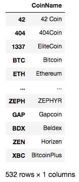

7. Remove the ```CoinName``` column from the DataFrame since it's not necessary for the clustering algorithm. Dataframe: ```crypto_df```    
 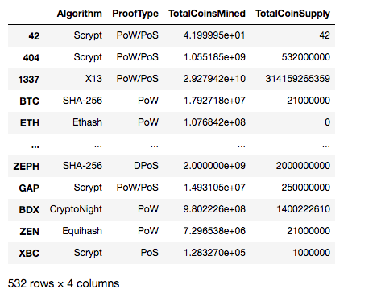

Finally, using the ```get_dummies()``` method for columns ```Algorithm``` and ```ProofType``` and the StandardScaler ```fit_transform()``` function to standardize the features.  The resulting DataFrame has 98 columns, which cannot be shown fully here, but here is an excerpt:
  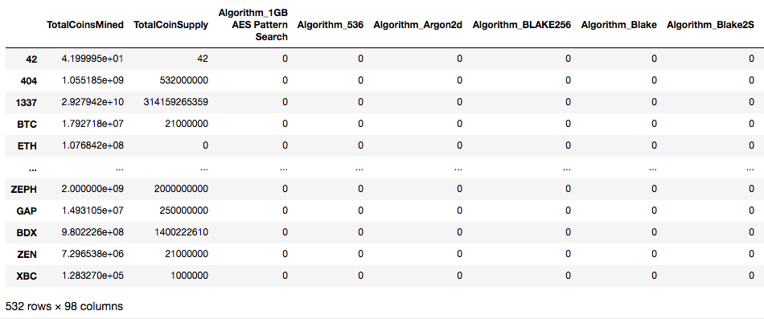


## Deliverable 2
### Reducing Data Dimensions Using PCA
The next steps involve, applying PCA to reduce the dimensions to 3 principal components.

The resulting DataFrame, ```pcs_df``` now includes columns ```PC 1```, ```PC 2```, and ```PC 3```, and uses the index of the ```crypto_df``` DataFrame as the index.  Please see below:  
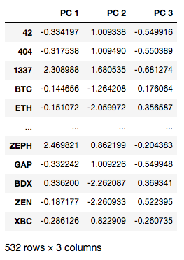


## Deliverable 3 
### Clustering Cryptocurrencies Using K-means
To determine an appropriate number of clusters for the dataset ```pcs_df```, start with plotting an elbow curve with hvplot to find the value for K.  
 
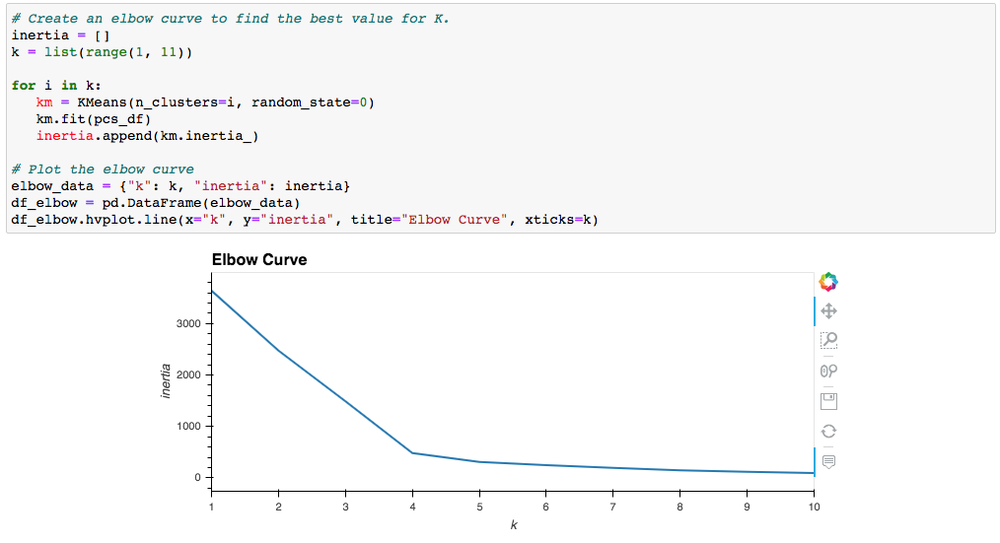


Based on the above curve, it looks like **4 clusters** is the place to start!


Using **K=4** and applying the K-means algorithm, provides the following predictions:
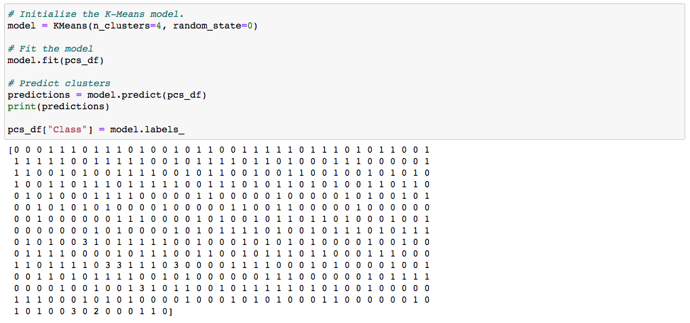

A new DataFrame, ```clustered_df``` is created by:

*  Concatenating the ```crypto_df``` and ```pcs_df``` DataFrames with the same index as the crypto_df DataFrame. 
*  Adding the ```CoinNames``` column from the ```cc_names_df``` dataset created earlier.  The resulting DataFrame:
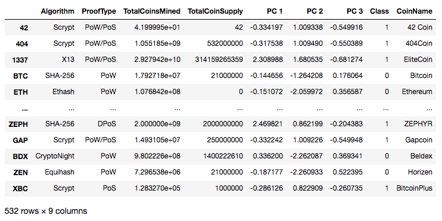

## Deliverable 4
### Visualizing Cryptocurrencies Results

With this new DataFrame, ```clustered_df``` , we start with a 3D Scatter plot using the Plotly Express **scatter_3d()** function to visualize the 4 Classes.  Each data point shows the ```CoinName``` and ```Algorithm``` data when hovering over.
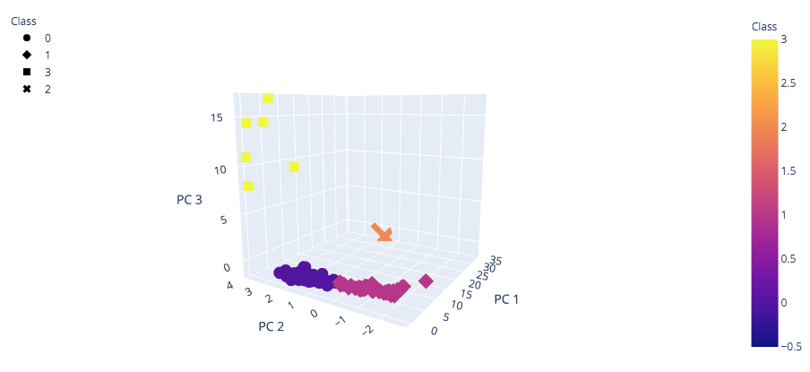


Next, a table is created featuring the tradable cryptocurrencies using the **hvplot.table()** function.
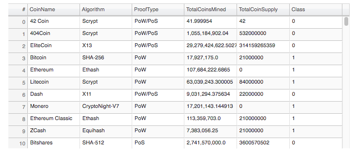

The total number of tradable cryptocurrencies in the clustered_df DataFrame: 
```The Total Number of tradable cryptocurrencies is 532.```

For the last visualization, a new dataset is created using the  **MinMaxScaler().fit_transform** method to scale the ```TotalCoinSupply``` and ```TotalCoinsMined``` columns (range of zero and one) from the ```clustered_df```, adding the ```CoinName``` from ```cc_names_df``` and the ```Class``` column from ```clustered_df```.  The resulting DataFrame:
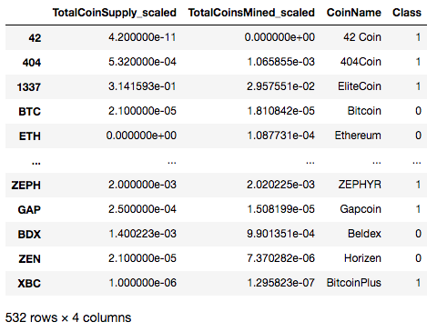


Finally, a 2D **hvplot scatter plot** with x="TotalCoinsMined_scaled", y="TotalCoinSupply_scaled", and by="Class" with the ```CoinName``` displayed when you hover over the the data point.
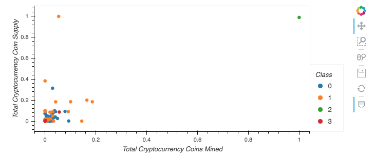

This plot highlights the fact that Class 2 has only 1 cryptocurrency, **BitTorrent**, quite the outlier!

So, what if we increase to 5 clusters, another acceptable option to test?  What does that look like?

Well, not terribly different...Class 2 is still only 1 coin, Class 3 is basically the same, and Classes 0 and 1 broke out into 3 Classes: 0, 1, 4.

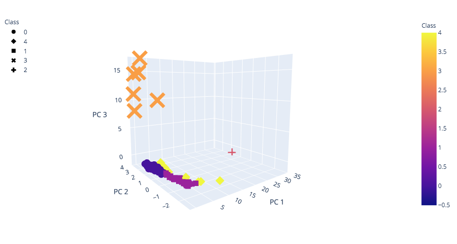

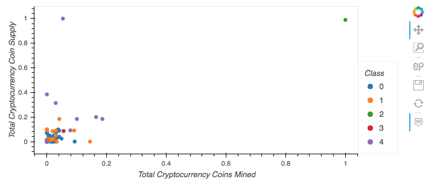
